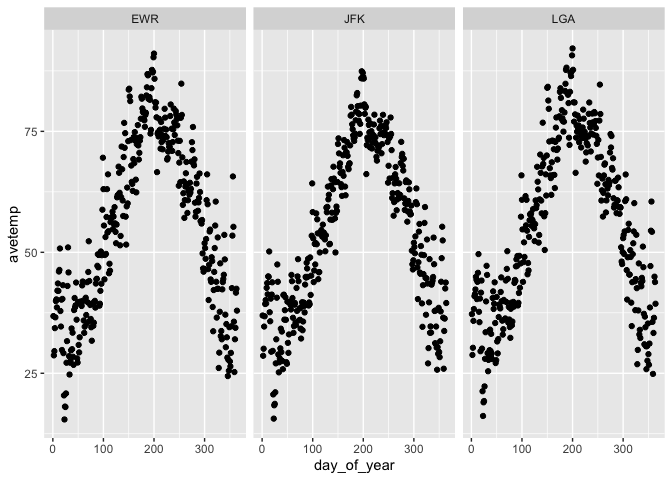
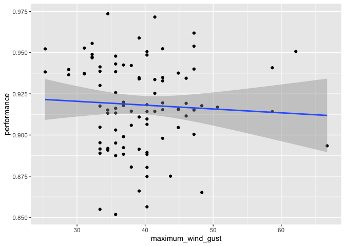
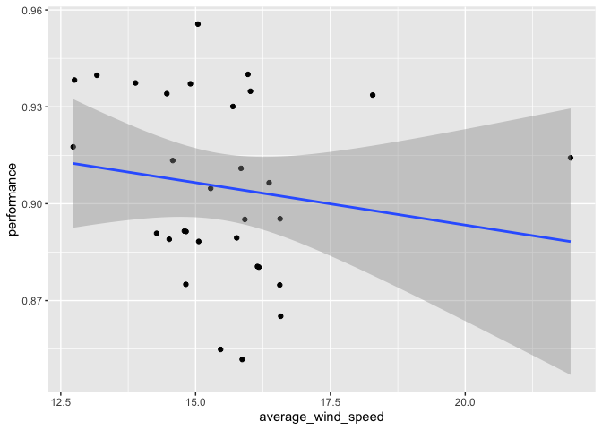

Practice Exam
=============

This practice exam asks you to do several code wrangling tasks that we
have done in class so far.

Clone this repo into Rstudio and fill in the necessary code. Then,
commit and push to github. Finally, turn in a link to canvas.

    ## ── Attaching packages ─────────────────────────────────────────────────────────────────────────────────────────── tidyverse 1.3.0 ──

    ## ✓ ggplot2 3.2.1     ✓ purrr   0.3.3
    ## ✓ tibble  2.1.3     ✓ dplyr   0.8.3
    ## ✓ tidyr   1.0.2     ✓ stringr 1.4.0
    ## ✓ readr   1.3.1     ✓ forcats 0.4.0

    ## ── Conflicts ────────────────────────────────────────────────────────────────────────────────────────────── tidyverse_conflicts() ──
    ## x dplyr::filter() masks stats::filter()
    ## x dplyr::lag()    masks stats::lag()

Make a plot with three facets, one for each airport in the weather data.
The x-axis should be the day of the year (1:365) and the y-axis should
be the mean temperature recorded on that day, at that airport.

    library(lubridate)

    ## 
    ## Attaching package: 'lubridate'

    ## The following object is masked from 'package:base':
    ## 
    ##     date

    weather %>% mutate(day_of_year = yday(time_hour)) %>% 
      group_by(origin,day_of_year) %>% 
      summarise(avetemp=mean(temp)) %>% 
      ggplot() + 
      geom_point(mapping = aes(x = day_of_year, y = avetemp)) + 
      facet_wrap(~ origin)

    ## Warning: Removed 1 rows containing missing values (geom_point).

Make a non-tidy matrix of that data where each row is an airport and
each column is a day of the year.

    weather %>% mutate(day_of_year = yday(time_hour)) %>% 
      group_by(origin,day_of_year) %>% 
      summarise(avetemp=mean(temp)) %>% 
      pivot_wider(names_from = day_of_year, values_from = avetemp)

    ## # A tibble: 3 x 365
    ## # Groups:   origin [3]
    ##   origin   `1`   `2`   `3`   `4`   `5`   `6`   `7`   `8`   `9`  `10`  `11`  `12`
    ##   <chr>  <dbl> <dbl> <dbl> <dbl> <dbl> <dbl> <dbl> <dbl> <dbl> <dbl> <dbl> <dbl>
    ## 1 EWR     36.8  28.7  29.6  34.3  36.6  39.9  40.3  38.6  42.1  43.6  42.0  46.0
    ## 2 JFK     36.9  28.6  30.1  34.7  36.8  39.3  40.1  39.4  42.7  43.6  41.3  45.0
    ## 3 LGA     37.2  28.8  30.3  35.8  38.3  41.0  41.4  42.3  44.9  44.3  40.3  43.9
    ## # … with 352 more variables: `13` <dbl>, `14` <dbl>, `15` <dbl>, `16` <dbl>,
    ## #   `17` <dbl>, `18` <dbl>, `19` <dbl>, `20` <dbl>, `21` <dbl>, `22` <dbl>,
    ## #   `23` <dbl>, `24` <dbl>, `25` <dbl>, `26` <dbl>, `27` <dbl>, `28` <dbl>,
    ## #   `29` <dbl>, `30` <dbl>, `31` <dbl>, `32` <dbl>, `33` <dbl>, `34` <dbl>,
    ## #   `35` <dbl>, `36` <dbl>, `37` <dbl>, `38` <dbl>, `39` <dbl>, `40` <dbl>,
    ## #   `41` <dbl>, `42` <dbl>, `43` <dbl>, `44` <dbl>, `45` <dbl>, `46` <dbl>,
    ## #   `47` <dbl>, `48` <dbl>, `49` <dbl>, `50` <dbl>, `51` <dbl>, `52` <dbl>,
    ## #   `53` <dbl>, `54` <dbl>, `55` <dbl>, `56` <dbl>, `57` <dbl>, `58` <dbl>,
    ## #   `59` <dbl>, `60` <dbl>, `61` <dbl>, `62` <dbl>, `63` <dbl>, `64` <dbl>,
    ## #   `65` <dbl>, `66` <dbl>, `67` <dbl>, `68` <dbl>, `69` <dbl>, `70` <dbl>,
    ## #   `71` <dbl>, `72` <dbl>, `73` <dbl>, `74` <dbl>, `75` <dbl>, `76` <dbl>,
    ## #   `77` <dbl>, `78` <dbl>, `79` <dbl>, `80` <dbl>, `81` <dbl>, `82` <dbl>,
    ## #   `83` <dbl>, `84` <dbl>, `85` <dbl>, `86` <dbl>, `87` <dbl>, `88` <dbl>,
    ## #   `89` <dbl>, `90` <dbl>, `91` <dbl>, `92` <dbl>, `93` <dbl>, `94` <dbl>,
    ## #   `95` <dbl>, `96` <dbl>, `97` <dbl>, `98` <dbl>, `99` <dbl>, `100` <dbl>,
    ## #   `101` <dbl>, `102` <dbl>, `103` <dbl>, `104` <dbl>, `105` <dbl>,
    ## #   `106` <dbl>, `107` <dbl>, `108` <dbl>, `109` <dbl>, `110` <dbl>,
    ## #   `111` <dbl>, `112` <dbl>, …

For each (airport, day) contruct a tidy data set of the airport’s
“performance” as the proportion of flights that departed less than an
hour late.

    df=flights %>% 
      group_by(origin,day) %>% 
      filter(!is.na(origin),!is.na(day),!is.na(dep_delay)) %>% 
      count(dep_delay<60) 
    names(df)[3]="iff"
    newdf=df %>% pivot_wider(names_from = iff,values_from=n) 
    names(newdf)[3]="notontime"
    names(newdf)[4]="ontime"
    newdf=newdf %>% mutate(performance=(ontime)/(ontime+notontime))
    newdf

    ## # A tibble: 93 x 5
    ## # Groups:   origin, day [93]
    ##    origin   day notontime ontime performance
    ##    <chr>  <int>     <int>  <int>       <dbl>
    ##  1 EWR        1       404   3456       0.895
    ##  2 EWR        2       415   3323       0.889
    ##  3 EWR        3       280   3725       0.930
    ##  4 EWR        4       175   3768       0.956
    ##  5 EWR        5       238   3563       0.937
    ##  6 EWR        6       232   3638       0.940
    ##  7 EWR        7       423   3402       0.889
    ##  8 EWR        8       541   3187       0.855
    ##  9 EWR        9       410   3261       0.888
    ## 10 EWR       10       475   3326       0.875
    ## # … with 83 more rows

Construct a tidy data set to that give weather summaries for each
(airport, day). Use the total precipitation, minimum visibility, maximum
wind\_gust, and average wind\_speed.

    newweather=weather %>% group_by(origin,day) %>% 
      filter(!is.na(wind_gust))%>% 
      summarise(total_precipitation=sum(precip),minimum_visibility=min(visib),maximum_wind_gust=max(wind_gust),average_wind_speed=mean(wind_speed))
    newweather

    ## # A tibble: 93 x 6
    ## # Groups:   origin [3]
    ##    origin   day total_precipita… minimum_visibil… maximum_wind_gu…
    ##    <chr>  <int>            <dbl>            <dbl>            <dbl>
    ##  1 EWR        1             0.29              1.5             33.4
    ##  2 EWR        2             0                 6               33.4
    ##  3 EWR        3             0                10               33.4
    ##  4 EWR        4             0                10               32.2
    ##  5 EWR        5             0                10               31.1
    ##  6 EWR        6             0.07              7               47.2
    ##  7 EWR        7             1.32              2               40.3
    ##  8 EWR        8             0.32              1.5             33.4
    ##  9 EWR        9             0.03              9               36.8
    ## 10 EWR       10             0.28              2.5             43.7
    ## # … with 83 more rows, and 1 more variable: average_wind_speed <dbl>

Construct a linear model to predict the performance of each
(airport,day) using the weather summaries and a “fixed effect” for each
airport. Display the summaries.

    newdf %>% left_join(newweather) %>% 
      ggplot(mapping = aes(x=maximum_wind_gust,y=performance))+
      geom_point()+
      geom_smooth(method="lm")

    ## Joining, by = c("origin", "day")

    data = left_join(newdf, newweather)

    ## Joining, by = c("origin", "day")

    fit = lm(performance ~ origin+total_precipitation+minimum_visibility+maximum_wind_gust, data = data)
    summary(fit)

    ## 
    ## Call:
    ## lm(formula = performance ~ origin + total_precipitation + minimum_visibility + 
    ##     maximum_wind_gust, data = data)
    ## 
    ## Residuals:
    ##       Min        1Q    Median        3Q       Max 
    ## -0.062869 -0.017356 -0.000262  0.017984  0.050054 
    ## 
    ## Coefficients:
    ##                       Estimate Std. Error t value Pr(>|t|)    
    ## (Intercept)          0.9025591  0.0166678  54.150  < 2e-16 ***
    ## originJFK            0.0195286  0.0064227   3.041 0.003120 ** 
    ## originLGA            0.0227256  0.0063395   3.585 0.000556 ***
    ## total_precipitation  0.0033329  0.0060213   0.554 0.581326    
    ## minimum_visibility   0.0021142  0.0008263   2.559 0.012237 *  
    ## maximum_wind_gust   -0.0002545  0.0003859  -0.659 0.511322    
    ## ---
    ## Signif. codes:  0 '***' 0.001 '**' 0.01 '*' 0.05 '.' 0.1 ' ' 1
    ## 
    ## Residual standard error: 0.02465 on 87 degrees of freedom
    ## Multiple R-squared:  0.2079, Adjusted R-squared:  0.1624 
    ## F-statistic: 4.567 on 5 and 87 DF,  p-value: 0.000957

Repeat the above, but only for EWR. Obviously, exclude the fixed effect
for each airport.

    newdf %>% left_join(newweather) %>% 
      filter(origin=="EWR") %>% 
      ggplot(mapping = aes(x=average_wind_speed,y=performance))+
      geom_point()+
      geom_smooth(method="lm")

    ## Joining, by = c("origin", "day")

    dataEWR = filter(data, origin == "EWR")
    fitEWR = lm(performance ~ total_precipitation+minimum_visibility+maximum_wind_gust, data = dataEWR)
    summary(fitEWR)

    ## 
    ## Call:
    ## lm(formula = performance ~ total_precipitation + minimum_visibility + 
    ##     maximum_wind_gust, data = dataEWR)
    ## 
    ## Residuals:
    ##       Min        1Q    Median        3Q       Max 
    ## -0.068004 -0.017986 -0.000185  0.016981  0.047261 
    ## 
    ## Coefficients:
    ##                       Estimate Std. Error t value Pr(>|t|)    
    ## (Intercept)          0.8971035  0.0339480  26.426   <2e-16 ***
    ## total_precipitation  0.0077640  0.0103842   0.748   0.4611    
    ## minimum_visibility   0.0034288  0.0015366   2.231   0.0342 *  
    ## maximum_wind_gust   -0.0003274  0.0008000  -0.409   0.6856    
    ## ---
    ## Signif. codes:  0 '***' 0.001 '**' 0.01 '*' 0.05 '.' 0.1 ' ' 1
    ## 
    ## Residual standard error: 0.02631 on 27 degrees of freedom
    ## Multiple R-squared:  0.1944, Adjusted R-squared:  0.1049 
    ## F-statistic: 2.172 on 3 and 27 DF,  p-value: 0.1145
